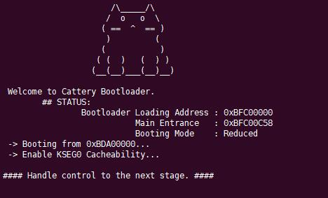

# Cattery Bootloader - First Stage Bootloader
most recently   
branch/master   
branch/rdev   
----
Cattery Bootloader is a first-stage bootloader targeting RagdollSoC, MIPS32EL, used for board-level initializing and have an exception vector that catches magic error.

For now, Cattery Bootloader has two booting modes(all of them are configured at coding time using #define DEBUG or not):

- Full Mode: Full functionality, contains several testing methods to test the board.

- Reduced Mode: Reduced functionality, used only for booting(u-boot or else).

# Copyright and Reference Notice

## Barebone
Cattery Bootloader's first prototype is based on barebone by Jun Sun, 10/16/2001.
Please refer to [Linux/MIPS Porting Guide](https://www.linux-mips.org/wiki/Linux/MIPS_Porting_Guide), section "Hello, world!".

## Baremetal softwares for TrivialMIPS platform @ THU
### Features below are derived from TrivialMIPS FSB
- Toggle KSEG0 Cachability
- Xilinx UART 16550 IP Core lowlevel initialization  
### Authorized usage by Harry-Chen @ THU.  
- If you want to redistribute FSB which includes these features, please contact Harry-Chen @ https://github.com/Harry-Chen  
- TrivialMIPS Software https://github.com/trivialmips/TrivialMIPS_Software  
